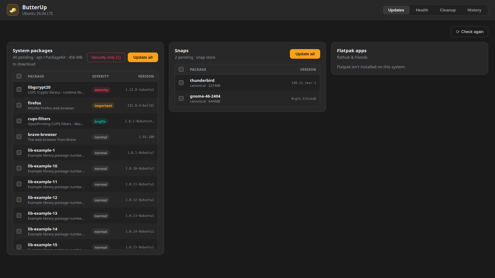
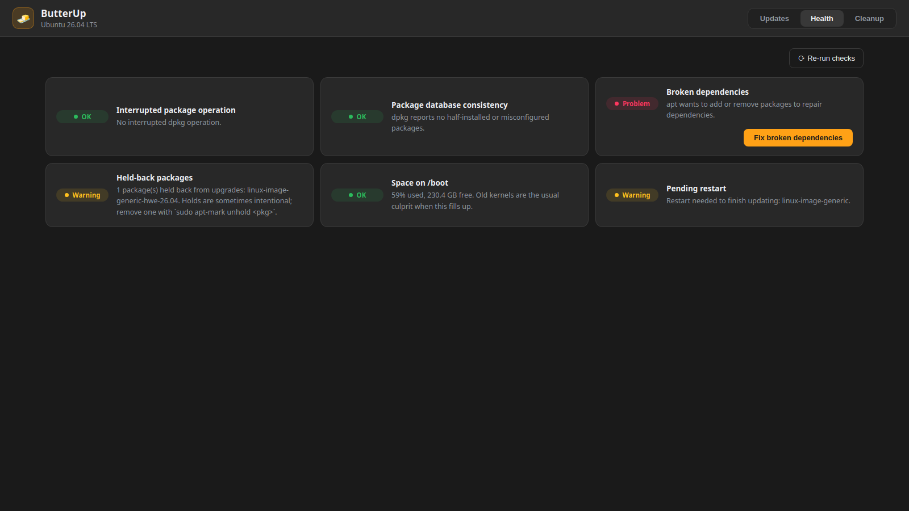
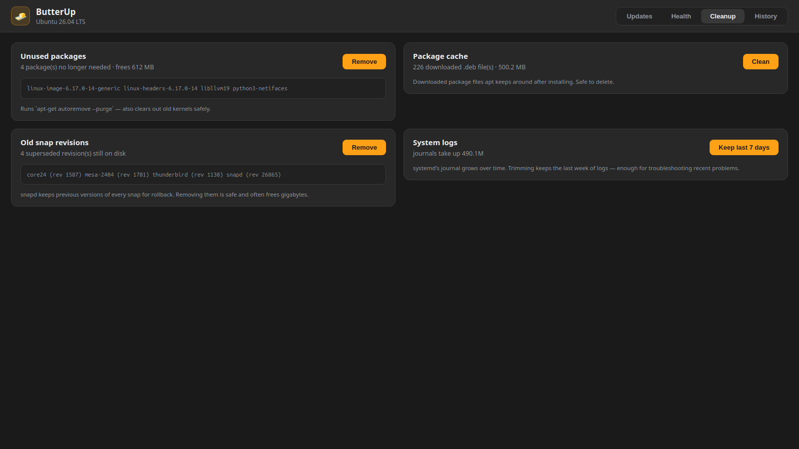

<div align="center">


# ButterUp

**Updates that run like butter — apt, snap & flatpak in one window.**

*From the Hindi phrase "makkhan jaisa chalna" — runs like butter.* 🧈

[](https://github.com/abdulfarhath/ButterUp/releases/latest)
[](https://github.com/abdulfarhath/ButterUp/releases)
[](LICENSE)




</div>

## Your update broke. Now what?

`dpkg was interrupted, you must manually run…` — if that sentence has ever ruined
your afternoon, ButterUp is for you. Keeping a Debian-based system healthy means
juggling apt, snap and flatpak, and when updates go wrong you end up copy-pasting
terminal incantations from decade-old forum threads.

ButterUp puts it all in one friendly window: see everything that's pending,
update all of it (or only the security fixes) with one click, **detect and repair
the classic broken states**, and reclaim the gigabytes hiding in caches, old
kernels and forgotten snap revisions. No terminal required — privilege
escalation goes through the system's normal password dialog (polkit).

## Install

Grab the `.deb` from the [latest release](https://github.com/abdulfarhath/ButterUp/releases/latest), then:

```bash
sudo apt install ./ButterUp_*.deb
```

That's it — launch **ButterUp** from your app menu.

Works on Debian 12+, Ubuntu 22.04+ and their derivatives (Mint, Pop!\_OS,
elementary…). PackageKit and pkexec are recommended and preinstalled on
standard Ubuntu desktops.

## What it does

| | |
|---|---|
| 🔄 **Update everything** | apt (via PackageKit), snap and flatpak side by side — update all, a selection, or **security fixes only**, with live progress and download size up front |
| 🩺 **Health checks** | 8 checks for the states that break systems: interrupted dpkg, broken dependencies, held packages, a filling `/boot`, kernel build-up, stale package lists, pending restarts |
| 🔧 **One-click repairs** | every problem ships with a guided, polkit-authorized fix — the same commands the forums would tell you to run, without the forums |
| 🧹 **Deep cleanup** | autoremove + old kernels, apt cache, superseded snap revisions, systemd journal — sizes shown before you commit |
| 📜 **History** | every package change on the system, parsed from apt's own transaction log: when, what, and who asked |
| 🪶 **Lightweight** | native Tauri 2 app (system WebKit, no Electron) — a ~4 MB .deb |

<div align="center">

<br/><br/>

</div>

## Why not just use the built-in updater?

Ubuntu's updater shows you updates — and nothing else. When an update *fails*,
you're on your own. ButterUp's health checks catch the classic failure states
and fix them with one authorized click. And unlike the cleanup tools of old
(Stacer, etc.), it's built on the system's proper interfaces — PackageKit over
D-Bus, polkit, snapd — not scraped commands, so it stays honest with your
package manager.

Everything it runs as root is a short, fixed whitelist you can audit in
[one file](src-tauri/src/privileged.rs).

## Building from source

System dependencies (Ubuntu/Debian):

```bash
sudo apt install build-essential curl wget file pkg-config \
  libwebkit2gtk-4.1-dev libgtk-3-dev libayatana-appindicator3-dev \
  librsvg2-dev nodejs npm rustc cargo
```

Run in development:

```bash
npm install
npm run tauri dev
```

Build a release `.deb`:

```bash
npm run tauri build
```

Run the (read-only) smoke tests against your live system:

```bash
cd src-tauri && cargo test --test smoke -- --nocapture
```

## Roadmap

- [x] Unified updates: apt (PackageKit over D-Bus), snap, flatpak
- [x] Security-only updates + download size preview
- [x] Health checks with one-click, polkit-authorized repairs
- [x] Cleanup: autoremove, old kernels, package cache, snap revisions, journal
- [x] Update history (apt transaction log)
- [x] .deb packaging + CI releases
- [ ] Tray icon + background update notifications
- [ ] Flatpak unused-runtime cleanup
- [ ] PPA / apt repository publishing

Contributions welcome — the codebase is small and readable (Rust + React),
and the roadmap above is a good place to start.

## Tech stack

- **Frontend:** React + TypeScript + Vite
- **Shell:** [Tauri 2](https://v2.tauri.app) (system WebKitGTK, not Electron)
- **Backend:** Rust — `zbus` for PackageKit/D-Bus, snap & flatpak CLIs, polkit via pkexec

## License

[GPL-3.0-or-later](LICENSE)
